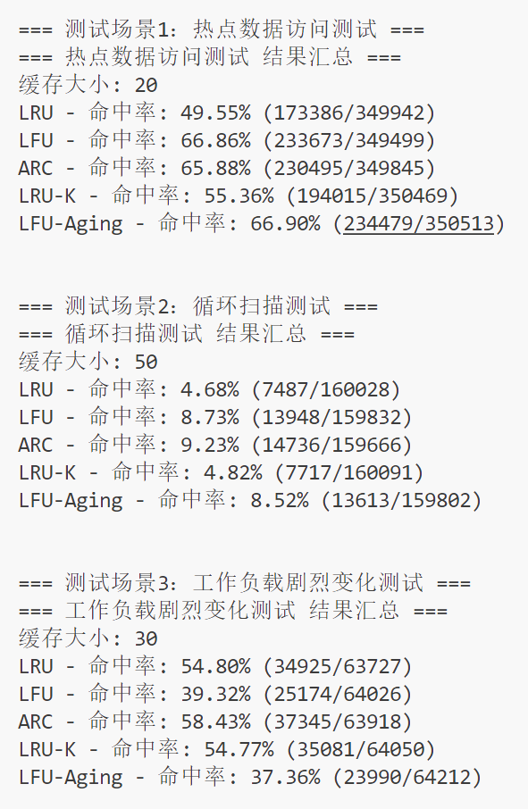

# RainCache

### 项目介绍
本项目使用多个页面替换策略实现一个线程安全的缓存：
- LRU：最近最久未使用
- LFU：最近不经常使用
- ARC：自适应替换

对于LRU和LFU策略，我在其基础的缓存策略上进行了相应的优化，例如：

- LRU优化：
    - LRU分片：对多线程下的高并发访问有性能上的优化
    - LRU-k：一定程度上防止热点数据被冷数据挤出容器而造成缓存污染等问题

- LFU优化：
    - LFU分片：对多线程下的高并发访问有性能上的优化
    - 引入最大平均访问频次：解决过去的热点数据最近一直没被访问，却仍占用缓存等问题

# 项目架构

### CachePolicy
`RainCache.h` 包含了 缓存策略提供的外部接口，作为基类以供覆写。

### LRU 部分
`RainLru.h` 包含了 基础的`LRU 算法实现`、`LRU-k 优化算法实现`、`LRU Hash-Slice 优化算法实现`

### LFU 部分
`RainLfu.h` 包含了 基础的`LFU 算法实现`、`LFU Hash-Slice 优化算法实现`

### Arc 部分
`RainArc/RainArc.h` 包含了 `ARC 核心算法实现`
`RainArc/RainArcNode.h` 包含了 `ARC 数据结构实现`
`RainArc/RainArcLru.h` 包含了 `ARC 中 LRU 算法实现`
`RainArc/RainArcLfu.h` 包含了 `ARC 中 LFU 算法实现`

# 环境搭建 && 运行测试

### 系统环境 
```
Ubuntu 24.04.2 LTS
```

### 编译
创建一个build文件夹并进入
```
mkdir build && cd build
```
生成构建文件
```
cmake ..
```
构建项目
```
make
```
如果要清理生成的可执行文件
```
make clean
```

### 运行
```
./main
```

### 测试结果
不同缓存策略缓存命中率测试对比结果如下：
（ps: 该测试代码只是尽可能地模拟真实的访问场景，但是跟真实的场景仍存在一定差距，测试结果仅供参考。）


